# Architecture

`tiny-tensor-compiler` is deliberately small, but it implements complete compiler vertical slices rather than disconnected framework scaffolding. `v0.1.0` froze the first single-output CPU/native pipeline; current development promotes new capabilities only when they can preserve the same explicit correctness boundaries across compiler layers.

```mermaid
flowchart LR
    A[Python tensor expressions\n+ typed inputs]
    B[Typed tensor IR\nstatic or named SymbolicDim values]
    C[Verifier]
    D[Optimization passes\nfold / simplify / DCE / canonicalize / CSE]
    S[Runtime symbolic binding\nconcrete clone + reverify]
    E[Virtual-buffer CPU IR]
    F[Liveness memory planner]
    G[Loop / kernel IR\nexplicit broadcast maps]
    H[Topology-driven fusion\nfirst-class fused expressions]
    I[Deterministic C11]
    J[Native compiler\nGCC / Clang / MSVC]
    K[Reusable native executable\nprocess + persistent cache]
    R[NumPy reference executor]

    A --> B --> C --> D
    D --> E --> F --> G --> H --> I --> J --> K
    D --> S --> E
    B --> R
```

## Correctness boundaries

The project treats verification and explicit semantics as compiler features, not test-only conveniences.

- Tensor IR verifies operation arity, ordering/dominance, inferred result types, return structure, legal opcodes, constants, input indices, and use-def consistency.
- Runtime-dynamic tensor IR may contain one or more named `SymbolicDim` values on arbitrary axes. Every declared symbol must occur in at least one runtime input, and every occurrence of the same symbol must bind to one identical non-negative runtime size.
- Symbolic broadcasting remains conservative. A symbol may broadcast with the same symbol or dimension `1`; two distinct symbols on the same aligned axis, or a symbol against a different non-unit concrete dimension, are not silently unified.
- Runtime symbolic binding validates exact input count, rank, static axes, and dtypes while collecting a complete binding for every symbol. The compiler then clones the tensor module, substitutes concrete integers for all symbols, and reruns the existing verifier before any physical lowering.
- `DynamicExecutable` owns a deep-cloned symbolic template, including copied constant payloads, so caller mutation after compilation cannot make old and new binding specializations represent different programs.
- A dynamic native specialization cache key contains the complete ordered symbolic binding tuple. Different bindings such as `B=2,W=3` and `B=2,W=7` therefore cannot reuse the wrong concrete executable.
- Buffer IR keeps virtual values single-write and separates virtual liveness from physical slot reuse.
- Memory reuse is allowed only after the previous value's last use and only for an exact `TensorType` match.
- Multiple returned tensors remain live through the terminal return block, so simultaneously returned same-typed values cannot be accidentally assigned one physical slot.
- Loop IR makes broadcasting explicit through deterministic index maps; kernels may not overwrite a physical slot still read by the same kernel.
- Fusion must preserve every returned value, including intermediates that are both returned and consumed by a later kernel.
- Fused kernels carry a canonical `FusedExpression`; the historical fused opcode string is a checked compatibility encoding rather than the semantic source of truth.
- The topology-driven fusion planner reasons about logical producer/consumer lifetimes rather than assuming physical buffer ids uniquely identify values. A physical slot may therefore be reused after a logical value's unique consumer without making that later value part of the earlier dependency edge.
- A fusion candidate is accepted only when its internal logical values have one internal consumer, no later external use, identity internal indexing, compatible iteration shapes/dtypes, and no final-output/leaf alias. Supported matching does not reassociate arithmetic.
- Verified input borrowing transforms already verified Loop IR and constructs a new `LoopProgram`, so input-lifetime splitting is rechecked by the existing allocation/read-before-write/kernel-alias verifier instead of bypassing it.
- A borrowed runtime input owns a dedicated read-only physical epoch. If the planner later reuses the original input slot as scratch storage, the borrowing transform appends a dedicated external slot and rewrites only that input epoch's reads, leaving the original scratch reuse intact.
- Borrowed runtime arrays must match exact shape/dtype and already be NumPy, C-contiguous, and aligned; the zero-copy contract rejects any input that would require hidden normalization.
- Integer lowering preserves fixed-width wrapping semantics across the scalar and generated-C paths.
- Floating-point ReLU preserves NaN behavior and canonicalizes negative zero to match the reference semantics.
- Runtime inputs are exact: concrete execution requires exact count, shape, and dtype; dynamic execution relaxes only explicitly declared symbolic axes and resolves every symbol before physical lowering. There is no silent cast.
- Native outputs are exact: every returned tensor has its own typed ABI pointer, and preallocated outputs must match shape/dtype/layout/alignment/mutability while remaining disjoint from runtime inputs and from one another.

## Execution paths

There are intentionally separate execution paths so optimized lowering can be checked against a simpler semantic baseline.

1. **Reference** — executes verified tensor IR with NumPy and defines the semantic baseline. For a symbolic module it first applies the same runtime binding and concrete specialization rules used by dynamic native execution. Supports one or multiple returned tensors.
2. **Loop interpreter** — executes explicit planned loop IR one output index at a time. Supports one or multiple returned tensors after memory planning and fusion. A `BorrowedLoopProgram` binds verified external input slots directly to caller NumPy arrays instead of materializing `LoopInput` copies. Loop IR itself remains concrete-shape IR.
3. **Native** — emits deterministic C11, compiles a shared library, and invokes one stable output-first ABI entrypoint through `ctypes`. A program with `N` returned tensors exposes `N` ordered typed output pointers followed by its input pointers; single-output programs retain the historical one-`out` signature. Borrowed inputs become typed `const` aliases to those ABI input pointers, so generated input-copy loops disappear while kernel code continues to read the same physical-buffer names. Dynamic execution compiles this same concrete native pipeline separately for each observed complete symbolic binding.

Native code may be reused in-process or persisted by content-addressed cache identity. Persistent library bytes are staged before loading so the cache remains immutable and Windows DLL locking does not poison reusable artifacts. `DynamicExecutable` adds a higher-level binding-specialization cache whose values are ordinary `NativeExecutable` handles, so identical complete bindings reuse the exact concrete specialization while different bindings retain independent generated-source/cache identities.

## Optimization philosophy

The compiler is correctness-first and conservative by design.

- Algebraic simplification avoids floating-point identities whose IEEE edge cases would change behavior.
- CSE is exact rather than algebraic.
- Fusion is verifier-backed and topology-driven, but deliberately bounded to two- through four-node integer `add`/`mul` DAGs that can be represented by the existing chain/tree/chain-tree fused expressions. Producer materialization order and root-side placement are not semantic restrictions; reassociation and arbitrary DAG growth remain out of scope.
- Contiguous-loop linearization happens only when identity indexing proves a row-major flat loop equivalent.
- Compiler vectorization hints do not select a vector width or change fallback semantics.
- SSE2 selection is semantic-step-driven for exact contiguous `int32` kernels: primitive or fused expressions are eligible only when the required fixed-width operations are representable by the backend's current `add`/ReLU plan. Multiplication, broadcast indexing, scalar/zero-extent shapes, other dtypes, and unsupported forms fall back to the general generated-C path.
- Symbolic dimensions are resolved before Buffer/Loop IR instead of introducing variable-length physical storage, symbolic loop arithmetic, or platform-dependent VLA behavior into the existing backend.

## Phase boundaries

### v0.1.0 — frozen

Included: static shapes, one returned tensor, explicit external inputs, CPU lowering, scalar reference/interpreter execution, C11 code generation, native compilation, cache reuse, conservative fusion, and selected SIMD specialization.

The release boundary remains historical and should not be rewritten as new capabilities land.

### Post-v0.1 — multi-output phase

Multiple returned tensors now cross the complete compiler stack: Python frontend, typed tensor IR, verifier, optimization use-def semantics, reference execution, virtual-buffer lowering, return-aware lifetime planning, loop IR, fusion safety, generated C, native compilation, reusable native execution, and the high-level `compile_module()` path.

Single-output callers keep the existing `numpy.ndarray` result and `out=np.ndarray` contract. Multi-output execution returns an ordered tuple; callers may optionally provide an ordered sequence of preallocated NumPy arrays. Generated C uses one native entrypoint with ordered output pointers, so kernels execute once and all terminal values are copied to their corresponding outputs without per-output recompilation or recomputation.

This phase is complete after the exact integrated candidate passes GCC/MSVC native differential execution and the repository's full Ubuntu/Windows CI matrix.

### Post-v0.1 — verified zero-copy input phase

Zero-copy external input binding is an explicit opt-in data-plane transform rather than a hidden runtime heuristic. `borrow_inputs(loop_program)` isolates each external input's read-only lifetime from scratch-buffer reuse, then returns a `BorrowedLoopProgram` that carries the strict runtime contract into both interpreter and native execution. `compile_module(..., borrow_inputs=True)` exposes the same path at the high-level API.

When an input's original physical slot is never written by another input or kernel, the transform borrows that slot in place and adds no storage. When that physical slot is reused after the input dies, the transform appends one dedicated external slot, rewrites reads during the input epoch to that slot, and preserves the planner's original scratch slot for later writes. Generated C maps borrowed slots to `const T *pN = inputK` aliases and omits the corresponding copy loops; the loop interpreter installs the caller array directly into the same logical slot.

The historical copied-input path remains the default compatibility behavior. Borrowed mode deliberately rejects Python sequences, non-contiguous views, wrong dtypes/shapes, or misaligned arrays rather than materializing a copy while claiming zero-copy execution.

### Post-v0.1 — runtime symbolic-shape phase

Named `SymbolicDim` values extend typed tensor shapes without making the physical backend symbolic. The runtime contract now accepts one or more symbols on arbitrary axes. Each symbol must be bound by at least one runtime input, every repeated occurrence must agree on one size, and all static axes/dtypes remain exact. Distinct symbols remain distinct constraints: they can coexist on independent broadcast axes through dimension `1`, but they are not implicitly equated when aligned against one another.

`compile_dynamic_module()` validates and deep-clones the symbolic tensor module into a `DynamicExecutable`. Each call derives a complete `{symbol: size}` binding from runtime inputs, then clones the tensor IR, replaces every symbolic occurrence with its integer binding, reruns the normal verifier, and only then enters the existing concrete `compile_module()` pipeline. The dynamic executable caches ordinary `NativeExecutable` values by the complete deterministic binding tuple, so `B=2,W=3`, `B=2,W=7`, and a later `B=2,W=3` select two concrete programs and reuse the first one on the third call.

The public `bind_dynamic_shapes()` helper exposes the same exact runtime binding rules. `DynamicExecutable.symbolic_dims` and `cached_bindings` expose the generalized contract. Existing single-symbol callers keep `symbolic_dim`, integer `specialize(2)`, and `cached_batch_sizes`; those convenience APIs deliberately reject multi-symbol executables rather than returning ambiguous data.

Zero-sized symbolic bindings are valid because the concrete compiler already has explicit zero-extent semantics. Multi-output and `borrow_inputs=True` cross the same specialization boundary. Arbitrary symbolic arithmetic or affine expressions, implicit equality solving between distinct symbols, reshape-style symbolic transforms, and runtime-sized Buffer/Loop IR remain explicitly outside this phase.

### Post-v0.1 — structured fusion phase

Fused chain/tree semantics are represented as first-class `FusedExpression` metadata in Loop IR. Fusion construction builds the expression first and emits legacy names such as `chain_add_mul` or `chain_tree_add_mul_add_mul` only through one checked compatibility encoder. Verification, the loop interpreter, generated C, and SIMD planning consume the structured expression directly when present; hand-built legacy Loop IR can still be decoded at the compatibility boundary.

The family-specific matching engine has now been replaced by one bounded topology-driven planner. It discovers dependency edges from previously materialized logical values, tracks each internal value through its unique consumer, and deliberately allows a physical buffer id to acquire a new logical identity after the earlier value dies. Safe mirror producer order, a chain on either root branch, and reversed root operands can therefore fuse without changing arithmetic grouping. The planner still emits only the existing chain/tree/chain-tree expression families and refuses unsupported larger or reassociated DAGs.

`tiny_tensor_compiler.loop_ir.fuse_elementwise()` remains only as a lazy compatibility delegate to the sole planner, so there is no second executable fusion implementation to drift from the public/compiler path.

### Post-v0.1 — expression-driven SSE2 selection phase

The SSE2 backend no longer maintains a fused-opcode whitelist. `build_i32_sse2_plan()` first handles the existing primitive `add`, `relu`, and `relu_add` kernels, then consumes the canonical `FusedExpression` for any fused kernel and accepts it only when every semantic step is representable by the backend's current fixed-width `add`/ReLU operations.

That semantic capability check automatically extends the existing compositional plan to exact contiguous `int32` forms such as `relu_tree_add_add_add` and `chain_tree_add_add_add_add` without adding family-specific emitters. The same plan drives the guarded SSE2 body and its fixed-width scalar tail/fallback, and native differential tests verify those newly eligible expressions against the reference semantics on both GCC-style and MSVC CI paths.

This is not a generalized SIMD or performance claim. The backend remains SSE2-specific, multiplication remains scalar because SSE2 has no 32-bit integer multiply-low instruction, and dtype/layout/indexing eligibility is still enforced separately by C codegen before a plan can be selected.

### Next architectural frontier

With dynamic specialization generalized to complete named bindings and fused/SSE2 selection driven by structured semantics, the next high-value frontiers are symbolic shape expressions/constraints beyond plain named dimensions, an ISA-neutral vector-plan layer justified by a second executable ISA/backend capability, larger structured DAG representation with an explicit cost model, parallel scheduling, or accelerator backends. The next phase should be selected by executable cross-layer value rather than by naming abstractions or enumerating another opcode/shape corner case.
