# Architecture

`tiny-tensor-compiler` is deliberately small, but it implements complete compiler vertical slices rather than disconnected framework scaffolding. `v0.1.0` froze the first single-output CPU/native pipeline; current development promotes new capabilities only when they can preserve the same explicit correctness boundaries across compiler layers.

```mermaid
flowchart LR
    A[Python tensor expressions\n+ typed inputs]
    B[Typed tensor IR\nstatic, named, affine, or linear symbolic dims]
    C[Verifier]
    D[Optimization passes\nfold / simplify / DCE / canonicalize / CSE]
    S[Runtime symbolic solving\nconcrete clone + reverify]
    E[Virtual-buffer CPU IR]
    F[Liveness memory planner]
    G[Loop / kernel IR\nexplicit broadcast maps]
    H[Cost-ranked bounded fusion\nfirst-class fused expressions]
    I[Deterministic C11]
    J[Native compiler\nGCC / Clang / MSVC]
    K[Reusable native executable\nprocess + persistent cache]
    R[NumPy reference executor]

    A --> B --> C --> D
    D --> E --> F --> G --> H --> I --> J --> K
    D --> S --> E
    B --> R
```

## Correctness boundaries

The project treats verification and explicit semantics as compiler features, not test-only conveniences.

- Tensor IR verifies operation arity, ordering/dominance, inferred result types, return structure, legal opcodes, constants, input indices, and use-def consistency.
- Runtime-dynamic tensor IR may contain one or more named `SymbolicDim` values, one-variable positive `AffineDim` terms, and canonical positive multi-symbol `LinearDim` expressions such as `2*B+W+3`.
- Every declared symbol must occur in at least one runtime input. Direct and affine occurrences preserve their existing exact binding rules; multi-symbol input axes contribute linear equations over the unresolved symbols.
- Relational solving uses exact rational elimination, not floating-point approximation. The runtime contract accepts a relational system only when it uniquely determines every unresolved symbol and every solved value is a non-negative integer. Inconsistent, rank-deficient, fractional, and negative solutions are rejected deterministically.
- Multi-symbol expressions use positive integer coefficients and non-negative integer offsets. Subtraction, division, negative coefficients, nonlinear products, inequality solving, and arbitrary symbolic algebra are not silently introduced.
- Symbolic broadcasting remains conservative and structural. A symbolic/affine/linear dimension may align with an exactly identical expression or dimension `1`; runtime equation solving never turns different expressions into compile-time equal dimensions.
- Runtime symbolic binding validates exact input count, rank, static axes, and dtypes, substitutes any direct/affine bindings into relational equations, solves the remaining exact system, and validates every redundant relation against the final complete binding.
- The compiler clones the tensor module, evaluates every symbolic expression to a concrete integer, and reruns the existing verifier before any physical lowering. Buffer IR, Loop IR, generated C, and the native ABI therefore remain concrete-shape only.
- `DynamicExecutable` owns a deep-cloned symbolic template, including copied constant payloads, so caller mutation after compilation cannot make old and new binding specializations represent different programs.
- A dynamic native specialization cache key contains the complete ordered symbolic binding tuple. Different solutions cannot reuse the wrong concrete executable, independent of whether the bindings came from direct, affine, or relational input axes.
- Buffer IR keeps virtual values single-write and separates virtual liveness from physical slot reuse.
- Memory reuse is allowed only after the previous value's last use and only for an exact `TensorType` match.
- Multiple returned tensors remain live through the terminal return block, so simultaneously returned same-typed values cannot be accidentally assigned one physical slot.
- Loop IR makes broadcasting explicit through deterministic index maps; kernels may not overwrite a physical slot still read by the same kernel.
- Fusion must preserve every returned value, including intermediates that are both returned and consumed by a later kernel.
- Fused kernels carry a canonical `FusedExpression`. Two- through four-node compatibility forms retain their historical fused opcode spellings, while five- and six-node generic DAGs use one `fused_dag` opcode whose structured metadata is the sole semantic source of truth.
- The topology-driven fusion planner reasons about logical producer/consumer lifetimes rather than assuming physical buffer ids uniquely identify values. A physical slot may therefore be reused after a logical value's unique consumer without making that later value part of the earlier dependency edge.
- A fusion candidate is accepted only when its internal logical values have one internal consumer, no later external use, identity internal indexing, compatible iteration shapes/dtypes, and no final-output/leaf alias. Supported matching does not reassociate arithmetic or reorder kernels.
- Generic DAG selection is bounded to adjacent five- or six-node integer binary windows. The planner ranks already-legal candidates by the number of intermediate materializations eliminated, then by smaller external-input footprint, then by coherent window size. This is a deterministic structural heuristic and is not a runtime performance claim.
- Shared internal subexpressions, non-adjacent fusion, floating-point generic DAGs, windows above six binary nodes, and any candidate that would require reassociation remain outside the current fusion contract.
- Verified input borrowing transforms already verified Loop IR and constructs a new `LoopProgram`, so input-lifetime splitting is rechecked by the existing allocation/read-before-write/kernel-alias verifier instead of bypassing it.
- A borrowed runtime input owns a dedicated read-only physical epoch. If the planner later reuses the original input slot as scratch storage, the borrowing transform appends a dedicated external slot and rewrites only that input epoch's reads, leaving the original scratch reuse intact.
- Borrowed runtime arrays must match exact shape/dtype and already be NumPy, C-contiguous, and aligned; the zero-copy contract rejects any input that would require hidden normalization.
- Integer lowering preserves fixed-width wrapping semantics across the scalar and generated-C paths.
- Floating-point ReLU preserves NaN behavior and canonicalizes negative zero to match the reference semantics.
- Runtime inputs are exact: concrete execution requires exact count, shape, and dtype; dynamic execution relaxes only explicitly declared symbolic axes and resolves every symbol before physical lowering. There is no silent cast.
- Native outputs are exact: every returned tensor has its own typed ABI pointer, and preallocated outputs must match shape/dtype/layout/alignment/mutability while remaining disjoint from runtime inputs and from one another.

## Execution paths

There are intentionally separate execution paths so optimized lowering can be checked against a simpler semantic baseline.

1. **Reference** — executes verified tensor IR with NumPy and defines the semantic baseline. For a symbolic module it first applies the same runtime direct/affine/relational solving and concrete specialization rules used by dynamic native execution. Supports one or multiple returned tensors.
2. **Loop interpreter** — executes explicit planned loop IR one output index at a time. Supports one or multiple returned tensors after memory planning and fusion. A `BorrowedLoopProgram` binds verified external input slots directly to caller NumPy arrays instead of materializing `LoopInput` copies. Loop IR itself remains concrete-shape IR.
3. **Native** — emits deterministic C11, compiles a shared library, and invokes one stable output-first ABI entrypoint through `ctypes`. A program with `N` returned tensors exposes `N` ordered typed output pointers followed by its input pointers; single-output programs retain the historical one-`out` signature. Borrowed inputs become typed `const` aliases to those ABI input pointers, so generated input-copy loops disappear while kernel code continues to read the same physical-buffer names. Dynamic execution compiles this same concrete native pipeline separately for each observed complete symbolic binding.

Native code may be reused in-process or persisted by content-addressed cache identity. Persistent library bytes are staged before loading so the cache remains immutable and Windows DLL locking does not poison reusable artifacts. `DynamicExecutable` adds a higher-level binding-specialization cache whose values are ordinary `NativeExecutable` handles, so identical complete bindings reuse the exact concrete specialization while different bindings retain independent generated-source/cache identities.

## Optimization philosophy

The compiler is correctness-first and conservative by design.

- Algebraic simplification avoids floating-point identities whose IEEE edge cases would change behavior.
- CSE is exact rather than algebraic.
- Fusion is verifier-backed and topology-driven. Existing two- through four-node chain/tree/chain-tree forms remain exact compatibility encodings; legal five- and six-node integer `add`/`mul` DAGs use structured generic metadata instead of proliferating opcode families. Every internal value remains single-consumer with no later external use, and arithmetic is neither reassociated nor reordered.
- Fusion candidate ranking measures only static structural savings: eliminated intermediate materializations, then external-input footprint, then coherent window size. It does not claim wall-clock speedup or substitute CI duration for a benchmark.
- Contiguous-loop linearization happens only when identity indexing proves a row-major flat loop equivalent.
- Compiler vectorization hints do not select a vector width or change fallback semantics.
- SSE2 selection is semantic-step-driven for exact contiguous `int32` kernels: primitive or fused expressions are eligible only when the required fixed-width operations are representable by the backend's current `add`/ReLU plan. An all-add generic DAG therefore uses the same existing semantic vector plan, while multiplication, broadcast indexing, scalar/zero-extent shapes, other dtypes, and unsupported forms fall back to the general generated-C path.
- Symbolic, affine, and relational linear dimensions are fully resolved before Buffer/Loop IR instead of introducing variable-length physical storage, symbolic loop arithmetic, or platform-dependent VLA behavior into the existing backend.

## Phase boundaries

### v0.1.0 — frozen

Included: static shapes, one returned tensor, explicit external inputs, CPU lowering, scalar reference/interpreter execution, C11 code generation, native compilation, cache reuse, conservative fusion, and selected SIMD specialization.

The release boundary remains historical and should not be rewritten as new capabilities land.

### Post-v0.1 — multi-output phase

Multiple returned tensors now cross the complete compiler stack: Python frontend, typed tensor IR, verifier, optimization use-def semantics, reference execution, virtual-buffer lowering, return-aware lifetime planning, loop IR, fusion safety, generated C, native compilation, reusable native execution, and the high-level `compile_module()` path.

Single-output callers keep the existing `numpy.ndarray` result and `out=np.ndarray` contract. Multi-output execution returns an ordered tuple; callers may optionally provide an ordered sequence of preallocated NumPy arrays. Generated C uses one native entrypoint with ordered output pointers, so kernels execute once and all terminal values are copied to their corresponding outputs without per-output recompilation or recomputation.

This phase is complete after the exact integrated candidate passes GCC/MSVC native differential execution and the repository's full Ubuntu/Windows CI matrix.

### Post-v0.1 — verified zero-copy input phase

Zero-copy external input binding is an explicit opt-in data-plane transform rather than a hidden runtime heuristic. `borrow_inputs(loop_program)` isolates each external input's read-only lifetime from scratch-buffer reuse, then returns a `BorrowedLoopProgram` that carries the strict runtime contract into both interpreter and native execution. `compile_module(..., borrow_inputs=True)` exposes the same path at the high-level API.

When an input's original physical slot is never written by another input or kernel, the transform borrows that slot in place and adds no storage. When that physical slot is reused after the input dies, the transform appends one dedicated external slot, rewrites reads during the input epoch to that slot, and preserves the planner's original scratch slot for later writes. Generated C maps borrowed slots to `const T *pN = inputK` aliases and omits the corresponding copy loops; the loop interpreter installs the caller array directly into the same logical slot.

The historical copied-input path remains the default compatibility behavior. Borrowed mode deliberately rejects Python sequences, non-contiguous views, wrong dtypes/shapes, or misaligned arrays rather than materializing a copy while claiming zero-copy execution.

### Post-v0.1 — runtime symbolic and affine-shape phase

Named `SymbolicDim` values extend typed tensor shapes without making the physical backend symbolic. The runtime contract accepts one or more symbols on arbitrary axes and bounded one-variable affine expressions `a*B+b` with positive integer `a` and non-negative integer `b`. Each symbol must be solvable from at least one runtime input axis, every repeated direct or affine occurrence must agree on one integer value, and all static axes/dtypes remain exact.

For an affine occurrence, runtime binding solves `(extent-b)/a`; extents below the offset or residuals not divisible by the scale are deterministic shape errors rather than rounded/guessed bindings. Distinct symbols remain distinct constraints. Structurally identical affine terms may align through symbolic broadcasting, but `B`, `2*B`, and another symbol `W` are not implicitly equated even if selected runtime values could make their concrete extents equal.

`compile_dynamic_module()` validates and deep-clones the symbolic tensor module into a `DynamicExecutable`. Each call derives a complete `{symbol: size}` binding from runtime inputs, then clones the tensor IR, evaluates every direct/affine dimension to an integer, reruns the normal verifier, and only then enters the existing concrete `compile_module()` pipeline. The dynamic executable caches ordinary `NativeExecutable` values by the complete deterministic binding tuple, so direct and affine runtime contracts share one specialization/cache architecture rather than parallel execution paths.

The public `bind_dynamic_shapes()` helper exposes the same exact runtime solving rules. `DynamicExecutable.symbolic_dims` and `cached_bindings` expose the generalized contract. Existing single-symbol callers keep `symbolic_dim`, integer `specialize(2)`, and `cached_batch_sizes`; those convenience APIs deliberately reject multi-symbol executables rather than returning ambiguous data.

Zero-valued bindings are valid when the affine expression evaluates to a legal zero extent, such as `2*B` at `B=0`. Multi-output and `borrow_inputs=True` cross the same specialization boundary. This phase deliberately stopped before multi-symbol equation solving so its one-variable inversion contract remained explicit and independently verifiable.

### Post-v0.1 — exact relational shape phase

`LinearDim` promotes shape specialization from independent named dimensions to bounded cross-symbol relations without introducing a symbolic physical backend. Positive expressions such as `B+W`, `2*B+W`, and `2*B+3*W+1` are canonicalized by symbol name and combine repeated occurrences of the same symbol. One-symbol arithmetic collapses back to the existing `SymbolicDim` / `AffineDim` representation rather than creating a duplicate semantic form.

Runtime binding first preserves the established direct/affine behavior, then treats every multi-symbol input axis as an exact linear equation. Known direct/affine bindings are substituted into those equations. The remaining system is reduced with exact `fractions.Fraction` arithmetic, so there is no floating-point rank or rounding ambiguity. A solution is accepted only when the system has full rank for every unresolved symbol and each resulting value is an integer greater than or equal to zero.

Contradictory equations fail as inconsistent. Rank-deficient systems fail as underdetermined instead of choosing arbitrary free variables. Unique fractional or negative solutions fail the tensor-extent contract. Once a complete binding exists, every original relation is evaluated again; redundant equations therefore remain active correctness constraints rather than being discarded after elimination.

Type inference does not invoke the solver. Broadcasting still accepts only structurally identical symbolic expressions or dimension `1`, which prevents a runtime-dependent relation from changing static result types. After solving, specialization clones the tensor IR, evaluates all direct/affine/linear dimensions to integers, reruns verification, and then reuses the unchanged Buffer IR, Loop IR, fusion, C11, native ABI, multi-output, zero-copy-input, and native-cache paths.

This phase is complete once exact relational solving, malformed-system rejection, reference execution, native multi-output execution, verified borrowed inputs, specialization-cache reuse, and zero-valued full-rank solutions pass the repository's GCC/MSVC CI matrix. Subtraction, division, negative coefficients, nonlinear expressions, inequalities, reshape-style symbolic transforms, and runtime-sized physical IR remain outside the contract.

### Post-v0.1 — structured fusion phase

Fused semantics are represented as first-class `FusedExpression` metadata in Loop IR. Existing two- through four-node binary chain/tree/chain-tree expressions retain names such as `chain_add_mul` or `chain_tree_add_mul_add_mul` through the checked compatibility encoder. Verification, the loop interpreter, generated C, and SIMD planning consume the structured expression directly when present; hand-built legacy Loop IR can still be decoded at that compatibility boundary.

The topology-driven planner discovers dependency edges from materialized logical values, tracks each internal value through its unique consumer, and deliberately allows a physical buffer id to acquire a new logical identity after the earlier value dies. Safe mirror producer order, a chain on either root branch, and reversed root operands can therefore fuse without changing arithmetic grouping.

Five- and six-node legal integer binary windows are no longer forced into another named opcode family. The planner constructs an ordered `generic-dag` `FusedExpression`, exposes it through the single `fused_dag` Loop IR opcode, and ranks legal candidates by eliminated intermediate materializations, then external-input footprint, then coherent binary window size. That rank is a deterministic compile-time structural policy, not a benchmark or throughput claim.

The same structured steps cross the loop interpreter and generated-C emitter. Contiguous all-add `int32` generic DAGs are also representable by the existing expression-driven SSE2 plan; any generic expression containing multiplication takes the ordinary generated-C scalar path because SSE2 still lacks 32-bit integer multiply-low. A legal generic DAG may absorb one terminal ReLU without inventing another opcode spelling.

The phase remains deliberately bounded: internal values must have one consumer and no later external use, internal edges must use identity indexing, all intermediate/output types must agree on exact `i32` or `i64`, and the final output may not alias a leaf. Shared internal subexpressions, floating-point generic DAGs, non-adjacent windows, reassociation, kernel reordering, and more than six binary nodes are not claimed.

`tiny_tensor_compiler.loop_ir.fuse_elementwise()` remains only as a lazy compatibility delegate to the sole planner, so there is no second executable fusion implementation to drift from the public/compiler path.

### Post-v0.1 — expression-driven SSE2 selection phase

The SSE2 backend no longer maintains a fused-opcode whitelist. `build_i32_sse2_plan()` first handles the existing primitive `add`, `relu`, and `relu_add` kernels, then consumes the canonical `FusedExpression` for any fused kernel and accepts it only when every semantic step is representable by the backend's current fixed-width `add`/ReLU operations.

That semantic capability check automatically extends the existing compositional plan to exact contiguous `int32` structured forms without adding family-specific emitters, including all-add generic DAGs. The same plan drives the guarded SSE2 body and its fixed-width scalar tail/fallback, and native differential tests verify eligible expressions against the reference semantics on both GCC-style and MSVC CI paths.

This is not a generalized SIMD or performance claim. The backend remains SSE2-specific, multiplication remains scalar because SSE2 has no 32-bit integer multiply-low instruction, and dtype/layout/indexing eligibility is still enforced separately by C codegen before a plan can be selected.

### Next architectural frontier

With exact relational shape solving and bounded generic five-/six-node structured fusion now executable, extending either phase by another coefficient combination or another node-count increment would be low-value farming. The next high-value frontiers are an ISA-neutral vector-plan layer only when justified by a second genuinely executable ISA/backend capability, parallel scheduling with explicit dependency and write-safety semantics, an accelerator backend, or a future shape-transform/reshape subsystem that creates a genuinely new symbolic requirement. The next phase should add a new executable compiler layer rather than merely raise an existing bound.
