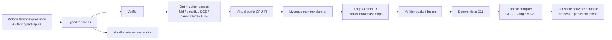

# Architecture

`tiny-tensor-compiler` is deliberately small, but it implements complete compiler vertical slices rather than disconnected framework scaffolding. `v0.1.0` froze the first single-output CPU/native pipeline; current development promotes new capabilities only when they can preserve the same explicit correctness boundaries across compiler layers.

## Correctness boundaries

The project treats verification and explicit semantics as compiler features, not test-only conveniences.

- Tensor IR verifies operation arity, ordering/dominance, inferred result types, return structure, legal opcodes, constants, input indices, and use-def consistency.
- Buffer IR keeps virtual values single-write and separates virtual liveness from physical slot reuse.
- Memory reuse is allowed only after the previous value's last use and only for an exact `TensorType` match.
- Multiple returned tensors remain live through the terminal return block, so simultaneously returned same-typed values cannot be accidentally assigned one physical slot.
- Loop IR makes broadcasting explicit through deterministic index maps; kernels may not overwrite a physical slot still read by the same kernel.
- Fusion must preserve every returned value, including intermediates that are both returned and consumed by a later kernel.
- Verified input borrowing transforms already verified Loop IR and constructs a new `LoopProgram`, so input-lifetime splitting is rechecked by the existing allocation/read-before-write/kernel-alias verifier instead of bypassing it.
- A borrowed runtime input owns a dedicated read-only physical epoch. If the planner later reuses the original input slot as scratch storage, the borrowing transform appends a dedicated external slot and rewrites only that input epoch's reads, leaving the original scratch reuse intact.
- Borrowed runtime arrays must match exact shape/dtype and already be NumPy, C-contiguous, and aligned; the zero-copy contract rejects any input that would require hidden normalization.
- Integer lowering preserves fixed-width wrapping semantics across the scalar and generated-C paths.
- Floating-point ReLU preserves NaN behavior and canonicalizes negative zero to match the reference semantics.
- Runtime inputs are exact: count, static shape, and dtype must match the compiled graph; there is no silent cast.
- Native outputs are exact: every returned tensor has its own typed ABI pointer, and preallocated outputs must match shape/dtype/layout/alignment/mutability while remaining disjoint from runtime inputs and from one another.

## Execution paths

There are intentionally separate execution paths so optimized lowering can be checked against a simpler semantic baseline.

1. **Reference** — executes verified tensor IR with NumPy and defines the semantic baseline. Supports one or multiple returned tensors.
2. **Loop interpreter** — executes explicit planned loop IR one output index at a time. Supports one or multiple returned tensors after memory planning and fusion. A `BorrowedLoopProgram` binds verified external input slots directly to caller NumPy arrays instead of materializing `LoopInput` copies.
3. **Native** — emits deterministic C11, compiles a shared library, and invokes one stable output-first ABI entrypoint through `ctypes`. A program with `N` returned tensors exposes `N` ordered typed output pointers followed by its input pointers; single-output programs retain the historical one-`out` signature. Borrowed inputs become typed `const` aliases to those ABI input pointers, so generated input-copy loops disappear while kernel code continues to read the same physical-buffer names.

Native code may be reused in-process or persisted by content-addressed cache identity. Persistent library bytes are staged before loading so the cache remains immutable and Windows DLL locking does not poison reusable artifacts.

## Optimization philosophy

The compiler is correctness-first and conservative by design.

- Algebraic simplification avoids floating-point identities whose IEEE edge cases would change behavior.
- CSE is exact rather than algebraic.
- Fusion is verifier-backed and limited to bounded elementwise shapes with explicit alias/liveness checks.
- Contiguous-loop linearization happens only when identity indexing proves a row-major flat loop equivalent.
- Compiler vectorization hints do not select a vector width or change fallback semantics.
- SSE2 paths are guarded specializations for selected exact contiguous `int32` kernels; unsupported forms fall back to the general generated-C path.

## Phase boundaries

### v0.1.0 — frozen

Included: static shapes, one returned tensor, explicit external inputs, CPU lowering, scalar reference/interpreter execution, C11 code generation, native compilation, cache reuse, conservative fusion, and selected SIMD specialization.

The release boundary remains historical and should not be rewritten as new capabilities land.

### Post-v0.1 — multi-output phase

Multiple returned tensors now cross the complete compiler stack: Python frontend, typed tensor IR, verifier, optimization use-def semantics, reference execution, virtual-buffer lowering, return-aware lifetime planning, loop IR, fusion safety, generated C, native compilation, reusable native execution, and the high-level `compile_module()` path.

Single-output callers keep the existing `numpy.ndarray` result and `out=np.ndarray` contract. Multi-output execution returns an ordered tuple; callers may optionally provide an ordered sequence of preallocated NumPy arrays. Generated C uses one native entrypoint with ordered output pointers, so kernels execute once and all terminal values are copied to their corresponding outputs without per-output recompilation or recomputation.

This phase is complete after the exact integrated candidate passes GCC/MSVC native differential execution and the repository's full Ubuntu/Windows CI matrix.

### Post-v0.1 — verified zero-copy input phase

Zero-copy external input binding is an explicit opt-in data-plane transform rather than a hidden runtime heuristic. `borrow_inputs(loop_program)` isolates each external input's read-only lifetime from scratch-buffer reuse, then returns a `BorrowedLoopProgram` that carries the strict runtime contract into both interpreter and native execution. `compile_module(..., borrow_inputs=True)` exposes the same path at the high-level API.

When an input's original physical slot is never written by another input or kernel, the transform borrows that slot in place and adds no storage. When that physical slot is reused after the input dies, the transform appends one dedicated external slot, rewrites reads during the input epoch to that slot, and preserves the planner's original scratch slot for later writes. Generated C maps borrowed slots to `const T *pN = inputK` aliases and omits the corresponding copy loops; the loop interpreter installs the caller array directly into the same logical slot.

The historical copied-input path remains the default compatibility behavior. Borrowed mode deliberately rejects Python sequences, non-contiguous views, wrong dtypes/shapes, or misaligned arrays rather than materializing a copy while claiming zero-copy execution.

### Next architectural frontier

Candidate frontiers now include dynamic shapes, generalized SIMD abstraction, general expression-DAG matching, parallel scheduling, and accelerator backends. The next phase should be selected by executable cross-layer value rather than by enumerating more opcode × SIMD corner cases.
