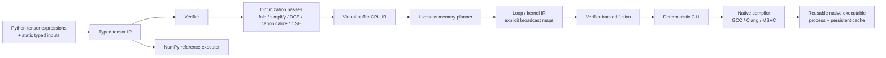

# Architecture

`tiny-tensor-compiler` is deliberately small, but it implements complete compiler vertical slices rather than disconnected framework scaffolding. `v0.1.0` froze the first single-output CPU/native pipeline; current development promotes new capabilities only when they can preserve the same explicit correctness boundaries across compiler layers.

## Correctness boundaries

The project treats verification and explicit semantics as compiler features, not test-only conveniences.

- Tensor IR verifies operation arity, ordering/dominance, inferred result types, return structure, legal opcodes, constants, input indices, and use-def consistency.
- Buffer IR keeps virtual values single-write and separates virtual liveness from physical slot reuse.
- Memory reuse is allowed only after the previous value's last use and only for an exact `TensorType` match.
- Multiple returned tensors remain live through the terminal return block, so simultaneously returned same-typed values cannot be accidentally assigned one physical slot.
- Loop IR makes broadcasting explicit through deterministic index maps; kernels may not overwrite a physical slot still read by the same kernel.
- Fusion must preserve every returned value, including intermediates that are both returned and consumed by a later kernel.
- Integer lowering preserves fixed-width wrapping semantics across the scalar and generated-C paths.
- Floating-point ReLU preserves NaN behavior and canonicalizes negative zero to match the reference semantics.
- Runtime inputs are exact: count, static shape, and dtype must match the compiled graph; there is no silent cast.

## Execution paths

There are intentionally separate execution paths so optimized lowering can be checked against a simpler semantic baseline.

1. **Reference** — executes verified tensor IR with NumPy and defines the semantic baseline. Supports one or multiple returned tensors.
2. **Loop interpreter** — executes explicit planned loop IR one output index at a time. Supports one or multiple returned tensors after memory planning and fusion.
3. **Native** — emits deterministic C11, compiles a shared library, and invokes a stable output-first ABI through `ctypes`. The current native ABI remains deliberately single-output; multi-output programs are rejected rather than silently miscompiled.

Native code may be reused in-process or persisted by content-addressed cache identity. Persistent library bytes are staged before loading so the cache remains immutable and Windows DLL locking does not poison reusable artifacts.

## Optimization philosophy

The compiler is correctness-first and conservative by design.

- Algebraic simplification avoids floating-point identities whose IEEE edge cases would change behavior.
- CSE is exact rather than algebraic.
- Fusion is verifier-backed and limited to bounded elementwise shapes with explicit alias/liveness checks.
- Contiguous-loop linearization happens only when identity indexing proves a row-major flat loop equivalent.
- Compiler vectorization hints do not select a vector width or change fallback semantics.
- SSE2 paths are guarded specializations for selected exact contiguous `int32` kernels; unsupported forms fall back to the general generated-C path.

## Phase boundaries

### v0.1.0 — frozen

Included: static shapes, one returned tensor, explicit external inputs, CPU lowering, scalar reference/interpreter execution, C11 code generation, native compilation, cache reuse, conservative fusion, and selected SIMD specialization.

The release boundary remains historical and should not be rewritten as new capabilities land.

### Post-v0.1 — current frontier

The first promoted capability is multiple returned tensors across the Python frontend, typed tensor IR, verifier, reference execution, virtual-buffer lowering, lifetime-aware memory planning, loop IR, fusion safety, and the loop CPU executor. Single-output callers keep the existing `numpy.ndarray` result contract; multi-output CPU/reference execution returns an ordered tuple of arrays.

The native C ABI is intentionally the next separate frontier. It still exposes one output pointer and therefore rejects a multi-output loop program through the single-output `return_slot` contract. Extending that ABI requires its own cross-platform native vertical slice rather than an unverified signature change hidden inside the CPU milestone.

Later candidate frontiers remain dynamic shapes, zero-copy input aliasing, generalized SIMD abstraction, general expression-DAG matching, parallel scheduling, and accelerator backends.
